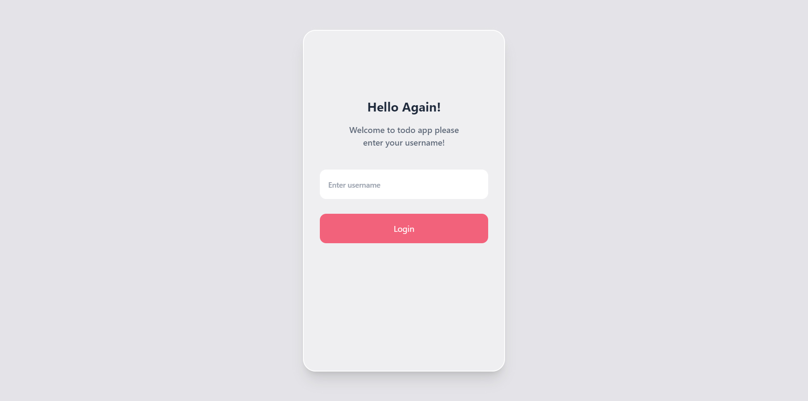
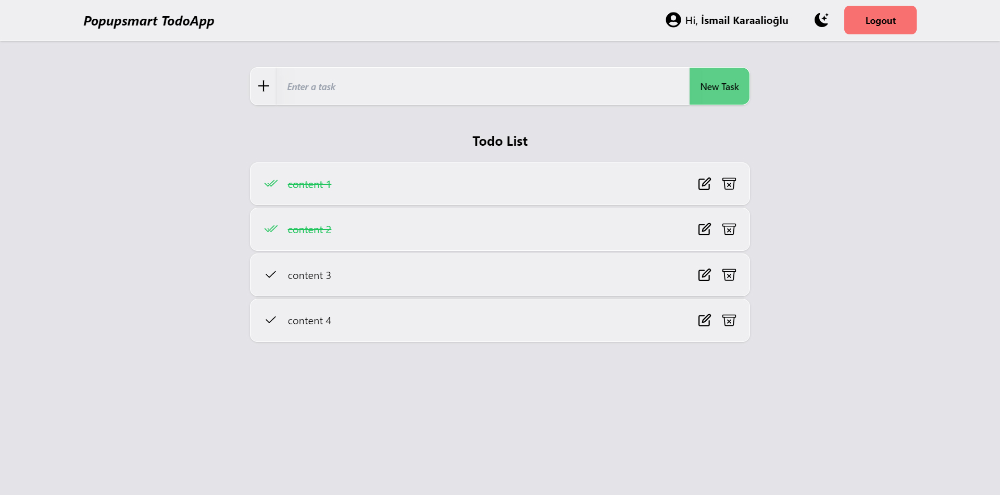
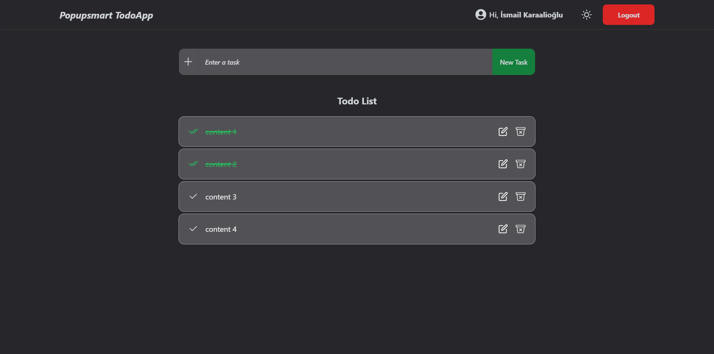

# Popupsmart - React Practicum First Case

* Patika.dev - Popupsmart Todo App With React

## :sparkles: Live Demo

[https://ismailkaraalioglu-popupsmartpracticum.netlify.app](https://ismailkaraalioglu-popupsmartpracticum.netlify.app)

## Project Features

:heavy_check_mark: In this project, the data is taken from the project we created on the https://mockapi.io/ site.  
:heavy_check_mark: State management in the project was done with Redux-Redux Toolkit.  
:heavy_check_mark: In order to log in to the application, you must enter your username on the login page.  
:heavy_check_mark: After logging into the application, you can add tasks to be done from the input field.  
:heavy_check_mark: When the input field is empty, you cannot add a task and you will receive a warning.  
:heavy_check_mark: The created to-do tasks are listed in the Todo List section.  
:heavy_check_mark: User can delete, edit and complete the 'todo'.  
:heavy_check_mark: It's given an alert each process to the user. All process complishes on the API Server at same time.  
:heavy_check_mark: There are two themes in the application, dark and light.  

## :fire: Technologies and Libraries

:point_right: React.js  
:point_right: Redux  
:point_right: Redux Toolkit  
:point_right: React Router  
:point_right: Tailwind CSS  
:point_right: Classnames  
:point_right: React-Icons  
:point_right: Axios  
:point_right: React-Hot-Toast  

## Screenshot

